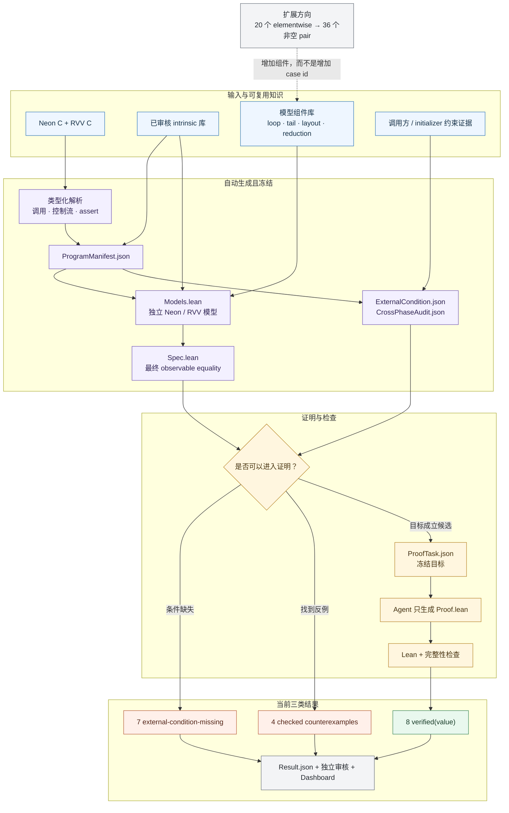

# SaltyRN 项目流程图

```mermaid
flowchart TB
  subgraph INPUT["输入与可复用知识"]
    direction LR
    C["Neon C + RVV C"]
    I["已审核 intrinsic 库"]
    K["模型组件库<br/>loop · tail · layout · reduction"]
    E["调用方 / initializer 约束证据"]
  end

  subgraph BUILD["自动生成且冻结"]
    direction LR
    P["类型化解析<br/>调用 · 控制流 · assert"]
    M["ProgramManifest.json"]
    L["Models.lean<br/>独立 Neon / RVV 模型"]
    S["Spec.lean<br/>最终 observable equality"]
    X["ExternalCondition.json<br/>CrossPhaseAudit.json"]
  end

  subgraph CHECK["证明与检查"]
    direction LR
    G{"是否可以进入证明？"}
    T["ProofTask.json<br/>冻结目标"]
    A["Agent 只生成 Proof.lean"]
    R["Lean + 完整性检查"]
  end

  subgraph OUT["当前三类结果"]
    direction LR
    V["8 verified(value)"]
    W["4 checked counterexamples"]
    B["7 external-condition-missing"]
    D["Result.json + 独立审核 + Dashboard"]
  end

  C --> P --> M --> L --> S --> G
  I --> M
  I --> L
  K --> L
  E --> X --> G
  M --> X
  G -->|条件缺失| B
  G -->|找到反例| W
  G -->|目标成立候选| T --> A --> R --> V
  V --> D
  W --> D
  B --> D

  SCALE["扩展方向<br/>20 个 elementwise → 36 个非空 pair"] -. "增加组件，而不是增加 case id" .-> K

  classDef input fill:#eef6ff,stroke:#3478b8,color:#16324a;
  classDef generated fill:#f3f0ff,stroke:#7256b8,color:#302456;
  classDef proof fill:#fff6df,stroke:#b78324,color:#4b3510;
  classDef good fill:#e9f8ee,stroke:#378556,color:#173d28;
  classDef warn fill:#fff0ea,stroke:#b85c38,color:#572517;
  classDef neutral fill:#f3f4f6,stroke:#68707a,color:#252a30;

  class C,I,K,E input;
  class P,M,L,S,X generated;
  class G,T,A,R proof;
  class V good;
  class W,B warn;
  class D,SCALE neutral;
```
