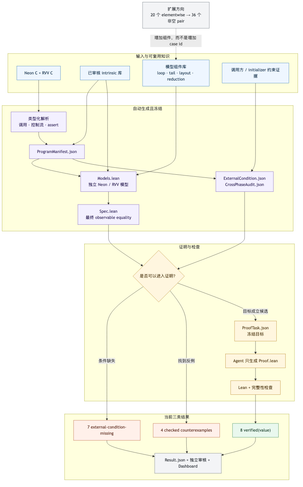

# SaltyRN 项目进展与下一阶段

更新时间：2026-08-30（Asia/Seoul）  
审计对象：`feat/elementwise-compiler@cc53aa5`

## 一句话结论

**Confirmed：**我们已经搭好一条可复用的、面向任意长度输入的 Lean value-level
验证链，并在十九个标量布局的 elementwise Neon/RVV pair 上完成八阶段交付；当前
结果是 2 个证明成功、10 个发现反例、7 个缺少外部约束。这个变化来自修正共享 FP
语义后重新检查全部程序：`f32-vrndne` 的假反例被证明消除，同时九个真实的 Arm/RVV
NaN exact-bit 差异不再被宿主浮点模型掩盖。下一步不是再为每个程序
手写一套 harness，而是把 parser、intrinsic 语义、layout、loop/reduction 等模型
组件逐步补齐，从二十个 elementwise 程序扩展到现有三十六个非空 pair。



Mermaid 源文件见 [saltyrn-project-pipeline.mmd](../figures/saltyrn-project-pipeline.mmd)。

## 技术思路是怎样一步步演进的

### 1. 起点：让程序像拼图一样自动进入验证

最初设想是：每个 Neon/RVV pair 都由一组 intrinsic 组成；只要这些 intrinsic 的
Lean 语义已经补齐，程序就应当自动生成验证任务。这个方向是对的，但后来发现
intrinsic 只是“算什么”的拼图，完整程序还需要回答三件事：数据怎样组织、控制流
怎样覆盖任意长度、最后观察哪些输出。

因此现在的 puzzle graph 实际有四类组件：

- exact typed intrinsic semantics；
- layout/view；
- loop、tail、strip-mine、reduction 等 execution components；
- entry、initializer、caller 三层条件以及 observation。

只有这四部分齐全，Models 才能准确生成；之后才轮到 agent 证明最终 Spec。

### 2. 为什么不能直接照搬旧 CVC5 路径

旧 CVC5 harness 会把两份 kernel body 嵌入生成的 C++ harness，编译后在一个具体
`batch` 和 `VLEN` 上运行。这里的 scalar/vector value 是符号值，所以执行结束后得到
的是一个有限 SMT term graph，而不是普通随机测试。

它的优点是可以借助 C/C++ 编译执行自然地展开原控制流，因而不必先写一个完整 C
frontend；但每个 `batch`、`VLEN` 都生成一份不同的有限公式。即使逐个检查
`batch = 1..N`，也不能得到“任意长度、任意合法 RVV 分块”的 theorem。

我们的目标是 arbitrary length，所以必须把循环本身表示成 Lean 中的递归/分块
语义。我们没有重写完整 C compiler，而是选择了一个 fail-closed 的受限静态 frontend：
只识别已审核的 kernel pattern，遇到没有消费的调用、控制流、assert 或 effect 就拒绝。

### 3. 第一个关键突破：把控制流压缩成少数 schedule family

对当前十九个标量程序的实际审计得到五种 Neon 形状：

| 数量 | Neon 主阶段 | 短尾存储 |
|---:|---|---|
| 10 | 每次 4 个元素 | `2, 1` |
| 6 | 每次 8 个元素 | `4, 2, 1` |
| 1 | 两阶段 `8 → 4` | `2, 1` |
| 1 | 两阶段 `16 → 8` | `4, 2, 1` |
| 1 | 两阶段 `64 → 8` | `4, 2, 1` |

它们可以统一成：零个或多个完整 block，加一个小于最后 block 宽度的 live prefix。
因此 Lean 不需要模拟每一次 C 指针自增，而是把输入 List 分成完整 block 和 tail，并
证明分块消费的结果等于对整个逻辑输入的处理。

十九个 RVV 程序都属于更统一的 strip-mine family：剩余长度非零时选择正的 `vl`，
处理这一块，然后输入、输出和剩余长度都前进 `vl`。Lean 用
`PositivePartition input.length` 表示所有正进度分块，而不是只固定一种运行时 `vl`。
这里证明的是 value-level 分块无关性；真实 ISA 的 `vsetvl` 合法性仍是更高一层。

### 4. intrinsic 拼图随后才能真正复用

控制流被压缩后，每个 block 内部才可以按照两边 C 的 dataflow，分别调用 Neon 和
RVV 的 exact typed intrinsic denotation。目前十九个程序使用的 180 个 exact variant
都已 Lean-check 并独立审核。关键要求是两边 Models 独立生成，不能先假设一个共同的
scalar function 再让两边都调用它，否则最终相等可能只是生成器制造出的同义反复。

### 5. assert 迫使我们把“条件”分成三层

入口处的 `assert(batch != 0)`、`assert(batch % sizeof(T) == 0)` 等是函数声明的
输入域，当前 frontend 会翻译成 typed entry contract，并要求 Neon/RVV 两边一致。

一个简单的局部例子是 `qs8-f32-vcvt`：主循环每次减去 8 个字节；进入 tail 分支时，
C 中写着：

```c
if (batch != 0) {
  assert(batch >= 1 * sizeof(int8_t));
  assert(batch <= 7 * sizeof(int8_t));
  ...
}
```

循环退出给出 `batch < 8`，分支条件给出 `batch > 0`，因此 `1 <= batch <= 7` 是
该程序点上的派生不变量，不是调用者必须额外提供的前提。当前实现不会忽略它：parser
读取它，fixed-tail recognizer 将它记录为 `fixed-tail-remainder`；如果局部 assert 不能
由已识别的路径条件推出，编译会 fail closed。

> **BIG TODO — 外部参数约束桥**
>
> `scale > 0` 且 finite/normal、zero point 范围、multiplier/shift 范围以及
> `min <= max` 不一定写在 kernel 入口。它们可能由 tensor validation、initializer
> 或更上层 API 建立。我们必须沿真实调用路径证明“这些 params 的生产者保证了这些
> 条件”，再把证据绑定到 `ExternalCondition.json`。不能把 initializer 自己的
> `assert` 直接冒充调用方保证。尤其当前 `s8-vclamp` 的 pinned 路径尚未建立
> `min <= max`。

### 6. elementwise 分层证明曾经是方法，现在应降级为 proof hint

当前 elementwise proof 大致分成：block/chunk 等于 `map` 或 `zipWith`，tail 等于
正确 live prefix，完整 loop 等于 `map`/`zipWith`，Neon/RVV 的 scalar action 相等，
最后推出 `completeValueEquivalenceClaim`。

例如 `f32-vadd` 中，生成器把同一个 `x`、`y` 各复制四份送进 Neon block，再取第一
个 lane，定义投影出的 `fNeon x y`；RVV 侧用 singleton chunk 定义 `fRvv x y`。但
“复制四份”本身并没有证明整个 block 是 elementwise 的，proof 还要单独证明任意
四个输入的 block 等于 `zipWith fNeon`。这一步阻止我们仅凭观察就假设 lane 独立。

**Confirmed design insight：**公开 Spec 逻辑上只需一个最终目标：在明确条件下，完整
Neon model 与完整 RVV model 的 observable result 相等。上述 element/block/tail/loop
命题不必成为 Spec 生成的准入门槛，可以转成 agent 可选使用的 proof hints。

更准确的动作是“降级为提示”，而不是把这些知识从库里全部删除。好的 proof agent
可以直接证明最终目标，也可以自行选择这些分解。安全性不依赖 agent 是否聪明：
`ProofTask.json` 冻结 theorem 和父 artifacts，agent 只能修改 `Proof.lean`，checker
拒绝 `sorry`、自定义 axiom、unsafe escape 和被篡改的 Models/Spec。

### 7. 反例让项目从“强行证明”转为“可信分类”

最初四个反例并不是同一种问题，修模后的结果也验证了这一点：

- `f32-vmax`、`f32-vmin` 是真实的 NaN exact-bit 语义差异；
- `f32-vrndne` 的模型问题已修复，并已得到全输入 value proof；
- `f32-vadd/vsub/vmul/vmulc/vdiv/vsqrt/vlrelu` 与 `vmax/vmin` 现在保留为
  真实的 Arm/RVV NaN exact-bit 反例；
- `s8-vclamp` 是真实的 main/tail 顺序差异，是否可排除取决于能否建立
  `min <= max` 的真实调用方约束。

所以 scale up 的成功标准不应是“三十六个全部被证明相等”，而应是三十六个都能被
准确生成模型并得到 verified、real counterexample 或 evidenced blocker 之一。

## 昨天八阶段交付完成到什么程度

| 阶段 | 当前状态 | 关键结果 |
|---|---|---|
| 1. 解析两份 C | 完成（19 个标量 pair） | 未消费的调用、控制流、assert、effect 会 fail closed |
| 2. 绑定 intrinsic | 完成 | 19 个程序使用的 180 个 exact typed variant 已 Lean-check 并独立审核 |
| 3. 识别 layout/family/assert | 完成（标量布局） | 支持 fixed、tail、multi-phase、RVV strip-mine；`f32-vcmul` 的复数布局仍待补 |
| 4. 生成独立 Models | 完成（19 个） | 两边 dataflow 从各自 C 和 intrinsic descriptor 生成 |
| 5. 生成并冻结 Spec/task | 完成 | `Spec.lean` 无 proof，目标及父依赖均 hash 绑定 |
| 6. Agent 生成 proof | 完成 | 只允许修改 `Proof.lean`，不能修改 Spec 或添加假设 |
| 7. Lean 检查并发布状态 | 完成 | 产出 verified、checked counterexample 或 explicit blocker |
| 8. Dashboard 与独立审核 | 完成 | 19/19 结果有审核记录，dashboard 从 artifact closure 自动推导 |

这里的“完成”只指当前十九个标量布局程序的 value-model 层，不代表 C abstract
machine、ISA 或编译后二进制已经得到完整证明。

## 当前结果应该怎样读

| 结果 | 数量 | 含义 | 下一步 |
|---|---:|---|---|
| `verified(value)` | 2 | `f32-f16-vcvt`、`f32-vrndne` 相对于修正后的 Lean 定义对任意逻辑长度成立 | 以后再建 C/ISA bridge |
| `counterexample` | 10 | 九个真实 FP exact-bit 差异，加一个 `s8-vclamp` 顺序差异 | 决定翻译、输入策略或观察关系，不能靠 agent 强证 |
| `external-condition-missing` | 7 | 需要适用域，但尚未从真实调用路径建立证据 | 先做两个直接 copy 的 dequantizer，再处理 derived initializer 约束 |
| `layout-unrecognized` | 1 | `f32-vcmul` 是 planar complex，不是普通单标量元素 | 增加一个可复用 grouped planar-complex layout |

七个 blocker 不是七种 parser bug。两种 dequantizer 的 zero point 和 scale 条件已经
能从 tensor validation 找到，预计可先闭合；其余五个涉及 ratio、multiplier、shift、
LReLU negative scale 等 initializer 派生范围，目前找到的是 initializer 内部
`assert`，还不能冒充调用方已经保证的条件。

## 每个文件在流程中的作用

核心链可以简化理解为：

1. Neon/RVV `.c` 是原始输入；
2. `ProgramManifest.json` 记录解析结果、入口条件、程序结构和所依赖的 exact
   intrinsics/layout/family；
3. `Models.lean` 分别表示 Neon 与 RVV 的完整 value execution；
4. `ExternalCondition.json` 记录外部适用域有没有证据，`CrossPhaseAudit.json` 检查
   多阶段一致性和反例；
5. `Spec.lean` 声明最终需要相等的 `completeValueEquivalenceClaim`；
6. `ProofTask.json` 冻结准确 theorem 和所有父文件 hash；
7. agent 只能填写 `Proof.lean`；
8. checker 生成 `Result.json`，随后独立 review 和 dashboard 校验整条依赖链。

当前生成的 `Spec.lean` 里仍保留若干 helper claims。这些可以继续为 proof agent
提供结构提示；下一版可以把“公开 Spec”与“内部 proof decomposition”在概念和界面
上分开。

## 从 20 个 elementwise 扩到 36 个 pair

**Confirmed corpus boundary：**当前语料是 40 个 source 文件、37 个 target 路径、
36 个非空 pair。三份 target 完全缺失，另一个 `u8-vclamp.c` 在 main 中是空文件。
二十个非空 pair 属于 elementwise，其中十九个是现有标量布局，一个是
`f32-vcmul`。

**Confirmed current limitation：**额外十六个非 elementwise pair 目前没有一个能直接
通过现有 flat-list elementwise compiler。至少十三个需要二维、gather、packed、
strided 或 pointer-table memory/layout；其余也需要 reduction 或多输出观察。同时它们
大约带来 170 个尚未进入当前 Lean canonical registry 的 intrinsic spelling。

这里需要修正一个说法：我们确实没有、也不需要实现“完整通用 C IR”，但当前的
typed AST extraction、`ProgramManifest`、layout capability 和 schedule capability 已经
共同构成了一个隐式的 restricted IR。从 20 扩到 36 时，如果继续只增加正则 pattern，
这些隐式组件会越来越难组合和审计；把它们收敛成一个小型 typed KernelIR 反而是
控制复杂度，而不是重写一个 compiler。

| 新程序类型 | 只补 loop 是否足够 | 还缺的核心模型 | 代表 case |
|---|---|---|---|
| grouped element | 否 | 一个逻辑元素由多个物理 lane/stream 组成 | `f32-vcmul` |
| reduction | 否 | accumulator state、归约顺序、scalar output | `qs8-rsum`, `qu8-rsum`, `rdsum` |
| 2-D permutation | 否 | 坐标、stride、读写地址映射 | `x32-transposec` |
| window/gather | 否 | 多地址读取、窗口边界、NaN/max 顺序 | `f32-maxpool`, `f32-argmaxpool` |
| mixed outputs | 否 | 同时观察数组输出和 scalar reduction | `f32-raddstoreexpminusmax` |
| convolution/GEMM | 否 | 嵌套循环、packed weights、pointer table、多 accumulator | dwconv、GEMM、IGEMM |

**Proposal：**不要继续堆正则和 kernel 特例，而是引入一个受限的 typed kernel IR，
让 parser 与 Models generator 共享这些可组合组件：

- scalar / grouped / packed / strided / gather layout；
- fixed loop / tail / strip-mine / reduction / window；
- 单输出、多输出和 scalar observation；
- 明确的 FP evaluation order 与 architecture-conditioned NaN semantics；
- 来自入口、initializer 和 caller 的分层条件。

较合理的扩展顺序是先做 `f32-vcmul` 的 grouped layout，再做 `qs8-rsum`、
`qu8-rsum`、`x32-transposec` 这类能引入少量新组件的程序，然后逐步进入 rdsum、
pooling、dwconv、GEMM/IGEMM。这样每一步都在增加一块可复用拼图，而不是宣称
三十六个已经一次性 cover。

## 目前仍需正视的问题

- `f32-vrndne` 已修复并全输入证明；九个真实 FP 反例需要决定上层是否要求
  exact-bit NaN 等价，不能擅自添加 no-NaN；
- `s8-vclamp` 需要确认真实 API 是否保证 `min <= max`，否则就是 C translation bug；
- 七个 external condition 需要 producer/caller bridge，而不是复制 initializer assert；
- `proof check` 对已发布结果还不是 byte-idempotent，会使已有 review stale；
- 当前 theorem 仍是 Lean value-model theorem，完整 C memory、alias/overread、ISA state、
  compiler correctness 都是后续独立层；
- 十六个复杂 pair 可能存在 FMA 顺序、reduction order、NaN/signed-zero 等真实精确等价
  风险，增加 parser 支持不等于它们最终都能证明。

## 现在最准确的项目定位

我们已经证明“拼图式自动化”在一个真实、非平凡的受限家族里可行：支持的程序可在
零新增 Python/Lean framework source 的情况下生成 artifacts，并由 agent 只负责
proof。接下来的研究问题是把 elementwise 专用拼图升级为受限 kernel IR，同时保持
fail-closed、独立模型、冻结 Spec、可检查反例和外部约束证据这五条底线。
